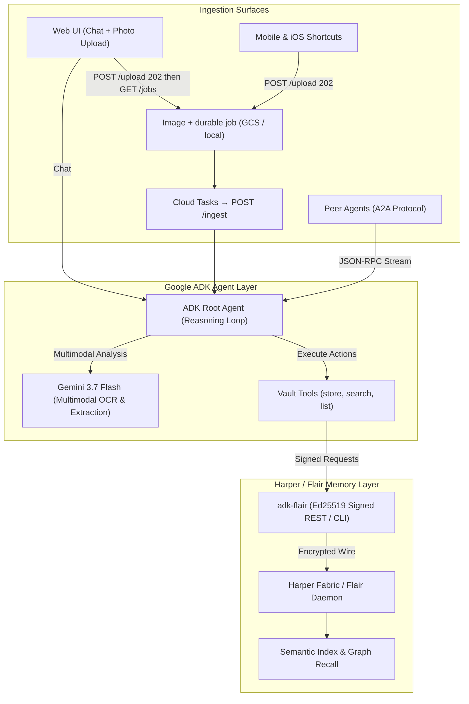

# Visual Memory Vault

> **Google ADK + Flair + Harper: Sovereign, Multimodal Agent Memory**

**Visual Memory Vault** is a multimodal AI agent that captures, indexes, and semantically recalls information from photos, receipts, documents, and screenshots.

Built with **[Google Agent Development Kit (ADK)](https://github.com/google/adk)**, **[Gemini 3.7 Flash](https://deepmind.google/technologies/gemini/)**, and **[Flair](https://github.com/tpsdev-ai/flair)** (powered by [Harper](https://harper.fast)) via the official [`adk-flair`](https://pypi.org/project/adk-flair/) package.

---

## 💡 The Trinity: Google ADK + Harper + Flair

### 1. Google ADK (Agent Development Kit) & Gemini 3.7
Google ADK provides the modular, production-ready runtime for agentic workflows:
- **Multimodal Intelligence by Default**: Powered by **Gemini 3.7 Flash**, the agent reads receipts, handwritten notes, complex documents, and screenshots directly in inference without separate brittle OCR pipelines.
- **Architectural Seams**: ADK's pluggable service architecture (`BaseMemoryService`, `BaseSessionService`, `BaseArtifactService`) makes it trivial to inject custom sovereign infrastructure without touching core reasoning loops.
- **Agent-to-Agent (A2A) Protocol**: First-class support for open agent interoperability, allowing other agents across your mesh to query the Visual Vault.

### 2. Harper: The High-Performance Distributed Data Fabric
Harper provides the underlying enterprise data fabric powering low-latency distributed agent storage:
- **Extreme Speed & Simplicity**: Combines structured database, document store, and real-time streaming in a single ultra-fast engine.
- **Edge to Cloud Fabric**: Run locally during development or deploy across global edge clusters via [Harper Fabric](https://harperdb.io) with automatic synchronization.
- **Zero Database Sprawl**: Eliminates the need for separate caching layers, message buses, and vector databases.

### 3. Flair: The Open Agent Memory Standard
Flair brings sovereign, persistent, and federated memory to the agent ecosystem:
- **Cryptographic Identity**: Every agent identity is backed by Ed25519 keypairs. Every memory write is cryptographically signed and verifiable.
- **Continuous Knowledge Consolidation**: Flair’s memory engine autonomously consolidates, deduplicates, and connects facts across conversations.
- **Native Semantic Search**: Vector similarity and graph relationships baked directly into the memory layer.
- **Seamless ADK Integration**: First-class Python integration via the official [`adk-flair`](https://pypi.org/project/adk-flair/) package.

### 🤝 The Winning Synergy
**Google ADK** powers world-class multimodal reasoning. **Harper** powers high-throughput distributed data fabric. **Flair** ensures your agent's memory remains sovereign, cryptographically secure, and permanent.

---

## 🏗️ Architecture



---

## 🌟 Key Capabilities

- **Automatic Visual Extraction**: Drop in a receipt, whiteboard photo, or WiFi card—Gemini extracts all text, numerical amounts, dates, and context with zero manual tagging.
- **Durable Semantic Recall**: Ask questions naturally in plain English (*"How much was that dinner in Austin?"*, *"What was the hotel door code?"*).
- **Dual Serving Surface**: Exposes native ADK SSE streams (`/run_sse`), A2A streaming endpoints (`/a2a/app/`), and a clean frontend proxy (`/chat`, `/upload`, `/media`).
- **Cryptographic Security**: Every record is signed with an Ed25519 private key seed, preventing unauthorized memory tampering.

---

## 🚀 Quickstart

### 1. Prerequisites

- **Python 3.12+** & **[uv](https://docs.astral.sh/uv/)**:
  ```bash
  mise use python@3.12 uv@latest
  # or: curl -LsSf https://astral.sh/uv/install.sh | sh
  ```
- **Flair**:
  ```bash
  npm i -g @tpsdev-ai/flair
  flair init
  ```
- **Gemini API Key**:
  ```bash
  export GOOGLE_API_KEY="your-gemini-api-key"
  ```

### 2. Install Project Dependencies

```bash
uv sync
```
*(This installs `adk-flair`, `google-adk`, `google-genai`, `fastapi`, `cryptography`, and all required tools)*.

### 3. Configure Flair Agent Identity

Provision an identity for the agent:
```bash
flair agent add visual-memory-vault

export FLAIR_URL="http://127.0.0.1:19926"
export FLAIR_AGENT_ID="visual-memory-vault"
export FLAIR_KEYFILE="$HOME/.flair/keys/visual-memory-vault.key"
```

### 4. Launch Backend & Frontend

Start the ADK Agent Backend:
```bash
uv run uvicorn app.fast_api_app:app --host 0.0.0.0 --port 8000 --reload
```

In a second terminal, start the Frontend Web Proxy:
```bash
uv run python frontend/main.py
```

Open **`http://localhost:8080`** in your browser to start chatting and uploading images.

---

## 📱 Mobile Ingestion (iOS Shortcuts / curl)

Upload photos directly from your phone camera or automated workflow. This is **send-and-forget**: the proxy persists the image, enqueues a durable ingest job, and returns immediately. Do not wait on a summary or `RECEIPT` line — iOS Shortcuts typically time out around 30s if they do.

```bash
curl -X POST http://localhost:8080/upload \
  -F "file=@receipt.jpg" \
  -F "subject=Dinner Receipt"
```

Response (`202 Accepted`):
```json
{
  "status": "accepted",
  "job_id": "<uuid>",
  "image_path": "/media/<uuid>_receipt.jpg"
}
```

The in-app web UI uses the same `POST /upload`, then polls `GET /jobs/{job_id}` until extract + `store_memory` finishes and the receipt chip can render. Production ingest is a **new HTTP request** created by Cloud Tasks (`POST /ingest`), not CPU leftover on the upload instance. Local uvicorn can drain jobs when `INGEST_DRAIN_INTERVAL_SEC` is set.

---

## 🧪 Test Suite

Run the full automated test suite (Unit tests + live Flair Integration tests):

```bash
uv run pytest tests/unit tests/integration/test_flair_vault.py -v
```

```
tests/unit/test_agent.py::test_agent_configuration PASSED
tests/unit/test_agent.py::test_agent_instruction_requires_receipt_custom_metadata PASSED
tests/unit/test_agent.py::test_app_structure PASSED
tests/unit/test_tools.py::test_store_memory_passes_receipt_custom_metadata PASSED
tests/unit/test_tools.py::test_search_memory_returns_live_shape PASSED
tests/unit/test_tools.py::test_list_memories_returns_live_shape PASSED
tests/unit/test_services.py::test_memory_service PASSED
tests/integration/test_flair_vault.py::test_flair_vault_end_to_end PASSED
======================== 24 passed in 0.85s =========================
```

---

## 📦 Tech Stack

| Component | Technology | Purpose |
| :--- | :--- | :--- |
| **Agent Framework** | [Google ADK](https://github.com/google/adk) | Agent orchestration, tools loop, sessions, and A2A protocol |
| **Multimodal LLM** | [Gemini 3.7 Flash](https://ai.google.dev/) | High-speed multimodal OCR, visual parsing, and reasoning |
| **Memory Engine** | [Flair](https://github.com/tpsdev-ai/flair) (on Harper) | Decentralized, Ed25519-signed long-term semantic memory |
| **ADK Adapter** | [`adk-flair`](https://pypi.org/project/adk-flair/) | Official ADK `BaseMemoryService` integration for Flair |
| **Backend API** | [FastAPI](https://fastapi.tiangolo.com/) | REST, SSE, and A2A JSON-RPC transport |
| **Package Manager** | [Astral uv](https://docs.astral.sh/uv/) | Blazing fast Python environment & dependency management |

---

## 📄 License

Apache 2.0.


