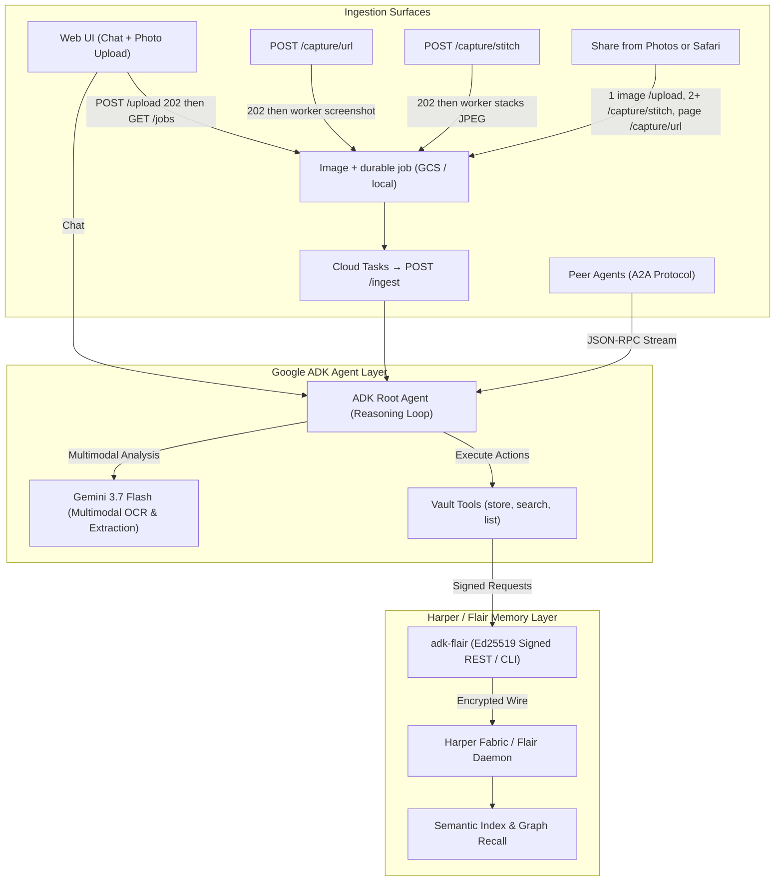

# Visual Memory Vault

> **Google ADK + Flair + Harper: Sovereign, Multimodal Agent Memory**

**Visual Memory Vault** is a multimodal AI agent that captures, indexes, and semantically recalls information from photos, receipts, documents, and screenshots.

Built with **[Google Agent Development Kit (ADK)](https://github.com/google/adk)**, **[Gemini 3.7 Flash](https://deepmind.google/technologies/gemini/)**, and **[Flair](https://github.com/tpsdev-ai/flair)** (powered by [Harper](https://harper.fast)) via the official [`adk-flair`](https://pypi.org/project/adk-flair/) package.

---

## 💡 The Trinity: Google ADK + Harper + Flair

### 1. Google ADK (Agent Development Kit) & Gemini 3.7
Google ADK provides the modular, production-ready runtime for agentic workflows:
- **Multimodal Intelligence by Default**: Powered by **Gemini 3.7 Flash**, the agent reads receipts, handwritten notes, complex documents, and screenshots directly in inference without separate brittle OCR pipelines.
- **Architectural Seams**: ADK's pluggable service architecture (`BaseMemoryService`, `BaseSessionService`, `BaseArtifactService`) makes it trivial to inject custom sovereign infrastructure without touching core reasoning loops.
- **Agent-to-Agent (A2A) Protocol**: First-class support for open agent interoperability, allowing other agents across your mesh to query the Visual Vault.

### 2. Harper: The High-Performance Distributed Data Fabric
Harper provides the underlying enterprise data fabric powering low-latency distributed agent storage:
- **Extreme Speed & Simplicity**: Combines structured database, document store, and real-time streaming in a single ultra-fast engine.
- **Edge to Cloud Fabric**: Run locally during development or deploy across global edge clusters via [Harper Fabric](https://harper.fast) with automatic synchronization.
- **Zero Database Sprawl**: Eliminates the need for separate caching layers, message buses, and vector databases.

### 3. Flair: The Open Agent Memory Standard
Flair brings sovereign, persistent, and federated memory to the agent ecosystem:
- **Cryptographic Identity**: Every agent identity is backed by Ed25519 keypairs. Every memory write is cryptographically signed and verifiable.
- **Continuous Knowledge Consolidation**: Flair’s memory engine autonomously consolidates, deduplicates, and connects facts across conversations.
- **Native Semantic Search**: Vector similarity and graph relationships baked directly into the memory layer.
- **Seamless ADK Integration**: First-class Python integration via the official [`adk-flair`](https://pypi.org/project/adk-flair/) package.

### 🤝 The Winning Synergy
**Google ADK** powers world-class multimodal reasoning. **Harper** powers high-throughput distributed data fabric. **Flair** ensures your agent's memory remains sovereign, cryptographically secure, and permanent.

---

## 🏗️ Architecture


```mermaid
flowchart TD
    subgraph Capture["Ingestion Surfaces"]
        Web["Web UI (Chat + Photo Upload)"]
        URL["POST /capture/url"]
        Stitch["POST /capture/stitch"]
        iOS["Share from Photos or Safari"]
        Persist["Image + durable job (GCS / local)"]
        Tasks["Cloud Tasks → POST /ingest"]
        A2A["Peer Agents (A2A Protocol)"]
    end

    subgraph ADK["Google ADK Agent Layer"]
        Gemini["Gemini 3.7 Flash (Multimodal OCR & Extraction)"]
        Agent["ADK Root Agent (Reasoning Loop)"]
        Tools["Vault Tools (store, search, list)"]
    end

    subgraph Harper["Harper / Flair Memory Layer"]
        Adapter["adk-flair (Ed25519 Signed REST / CLI)"]
        Daemon["Harper Fabric / Flair Daemon"]
        Vector["Semantic Index & Graph Recall"]
    end

    Web -->|POST /upload 202 then GET /jobs| Persist
    URL -->|202 then worker screenshot| Persist
    Stitch -->|202 then worker stacks JPEG| Persist
    Web -->|Chat| Agent
    iOS -->|1 image /upload, 2+ /capture/stitch, page /capture/url| Persist
    Persist --> Tasks
    Tasks --> Agent
    A2A -->|JSON-RPC Stream| Agent

    Agent -->|Multimodal Analysis| Gemini
    Agent -->|Execute Actions| Tools
    Tools -->|Signed Requests| Adapter
    Adapter -->|Encrypted Wire| Daemon
    Daemon --> Vector
```

---

## 🌟 Key Capabilities

- **Automatic Visual Extraction**: Drop in a receipt, whiteboard photo, or WiFi card—Gemini extracts all text, numerical amounts, dates, and context with zero manual tagging.
- **Durable Semantic Recall**: Ask questions naturally in plain English (*"How much was that dinner in Austin?"*, *"What was the hotel door code?"*).
- **Dual Serving Surface**: Exposes native ADK SSE streams (`/run_sse`), A2A streaming endpoints (`/a2a/app/`), and a clean frontend proxy (`/chat`, `/upload`, `/capture/url`, `/capture/stitch`, `/media`).
- **Cryptographic Security**: Every record is signed with an Ed25519 private key seed, preventing unauthorized memory tampering.

---

## 🚀 Quickstart

### 1. Prerequisites

- **Python 3.12+** & **[uv](https://docs.astral.sh/uv/)**:
  ```bash
  mise use python@3.12 uv@latest
  # or: curl -LsSf https://astral.sh/uv/install.sh | sh
  ```
- **Flair**:
  ```bash
  npm i -g @tpsdev-ai/flair
  flair init
  ```
- **Gemini API Key**:
  ```bash
  export GOOGLE_API_KEY="your-gemini-api-key"
  ```

### 2. Install Project Dependencies

```bash
uv sync
```
*(This installs `adk-flair`, `google-adk`, `google-genai`, `fastapi`, `cryptography`, and all required tools)*.

### 3. Configure Flair Agent Identity

Provision an identity for the agent:
```bash
flair agent add visual-memory-vault

export FLAIR_URL="http://127.0.0.1:19926"
export FLAIR_AGENT_ID="visual-memory-vault"
export FLAIR_KEYFILE="$HOME/.flair/keys/visual-memory-vault.key"
```

### 4. Launch Backend & Frontend

Start the ADK Agent Backend:
```bash
uv run uvicorn app.fast_api_app:app --host 0.0.0.0 --port 8000 --reload
```

In a second terminal, start the Frontend Web Proxy:
```bash
uv run python frontend/main.py
```

Open **`http://localhost:8080`** in your browser to start chatting and uploading images.

---

## 📱 Mobile Ingestion (Share from Photos or Safari)

Share from Photos or Safari is the phone path. One shortcut sends the share and stops when the proxy returns `202 Accepted`. It does not wait for Gemini, extract, or a `RECEIPT` line. A shortcut that waits on the write-up often hits the Shortcuts time limit; the job is already queued.

The shortcut stores your proxy base URL and API key in two text fields on the phone. The base URL is a required Import Question with no default: the importer pastes their own origin (`https://YOUR_VAULT_PROXY`, https, host only). The shortcut checks that shape and does not pin a shared host.

Auth is the same header production upload already uses: `X-Api-Key` set to that proxy's `PROXY_API_KEY`. The first time someone adds the shared shortcut, Shortcuts asks those two questions and saves the answers in that copy. Neither value is in the recipe. Actions and publishing steps: [docs/shortcuts/share-to-vault.md](docs/shortcuts/share-to-vault.md).

Public iCloud link: *(not published yet)*. Publish from the Shortcuts app with **Copy iCloud Link**. The publishing Apple ID signs it. The Apple Developer Program is not required. Importers review the actions before adding. Replace this sentence with the link after it exists.

| What you share | Request | Body |
| --- | --- | --- |
| 1 image | `POST /upload` | multipart field `file` |
| 2 to 8 images | `POST /capture/stitch` | multipart field `file`, repeated, in share order |
| A URL or Safari page | `POST /capture/url` | JSON `{"url":"…"}`. `subject` is optional |

If the share has both images and a URL, the images win (one image uploads, two or more stitch). Safari's share button sends the page URL alone.

Each call returns `202` with `status`, `job_id`, and `image_path`. The shortcut shows **Queued** and the `job_id`. A `4xx`, or any body that is not `status` `accepted` with a `job_id`, shows **Not queued** and the proxy's `detail` when the body includes one. More than 8 images stops in the shortcut before the request. Stitch still applies its own type and size limits. The shortcut does not call `POST /ingest` and does not poll.

### curl (Mac or a terminal)

Same three calls. `https://YOUR_VAULT_PROXY` stands in for your proxy origin. Replace `<YOUR_PROXY_KEY>`. Keep the key in the header, not the URL.

```bash
curl -X POST https://YOUR_VAULT_PROXY/upload \
  -H "X-Api-Key: <YOUR_PROXY_KEY>" \
  -F "file=@receipt.jpg" \
  -F "subject=Dinner Receipt"
```

```bash
curl -X POST https://YOUR_VAULT_PROXY/capture/stitch \
  -H "X-Api-Key: <YOUR_PROXY_KEY>" \
  -F "file=@one.jpg" \
  -F "file=@two.png" \
  -F "subject=Trip"
```

```bash
curl -X POST https://YOUR_VAULT_PROXY/capture/url \
  -H "X-Api-Key: <YOUR_PROXY_KEY>" \
  -H "Content-Type: application/json" \
  -d '{"url":"https://example.com","subject":"Example"}'
```

Response (`202 Accepted`):

```json
{
  "status": "accepted",
  "job_id": "<uuid>",
  "image_path": "/media/<uuid>_…"
}
```

Optional status check, not part of the share:

```bash
curl "https://YOUR_VAULT_PROXY/jobs/<job_id>" \
  -H "X-Api-Key: <YOUR_PROXY_KEY>"
```

`status` is `pending`, `succeeded`, or `failed`.

On a local proxy (`http://localhost:8080`) the paths and bodies are the same. Send `X-Api-Key` when `PROXY_API_KEY` is set. `ALLOW_UNAUTHENTICATED=1` is local open access only.

The in-app web UI uses the same `POST /upload`, then polls `GET /jobs/{job_id}` until extract + `store_memory` finishes and the receipt chip can render. Production ingest is a **new HTTP request** created by Cloud Tasks (`POST /ingest`), not CPU leftover on the upload instance. Local uvicorn can drain jobs when `INGEST_DRAIN_INTERVAL_SEC` is set. Phone Share does not poll and must not call `/ingest`.

### Capture a public page

`POST /capture/url` takes a public `http` or `https` URL, reserves an image path, and returns the same `202` as an upload. The worker screenshots the page (viewport JPEG), saves it like an uploaded photo, then runs the existing extract and `store_memory` path. Poll `GET /jobs/{job_id}`. There is no `?wait=1`. The phone sends this from Safari; the proxy base URL and `X-Api-Key` header are in Mobile Ingestion above.

```bash
curl -X POST http://localhost:8080/capture/url \
  -H "Content-Type: application/json" \
  -d '{"url":"https://example.com","subject":"Example"}'
```

Response (`202 Accepted`):

```json
{
  "status": "accepted",
  "job_id": "<uuid>",
  "image_path": "/media/<uuid>_page.jpg"
}
```

The stored memory's `custom_metadata` includes `source_url` (the requested URL), `captured_at`, and `capture_kind` `url`. When the page has them, it also includes `page_title` (the document title at capture time), `final_url` (the URL after redirects; it may differ from `source_url`), and `outbound_links`: up to 50 `{href, text}` pairs. Those are the first distinct http(s) anchors in document order, not viewport visibility, excluding links back to the same document. Link text is whitespace-collapsed and at most 160 characters. If the list would push the metadata past 48KB, links drop from the end so Flair still accepts the record. Link targets are not fetched, and page HTML is not stored. A missing title or an empty link list does not fail the job; the screenshot and the original fields are still stored. The description mentions the page so recall can find it.

Only public HTTP(S) URLs are captured. Other schemes, unresolvable hosts, and addresses that are loopback, private, link-local, or cloud metadata finish as `failed` with `unsupported_scheme`, `bad_url`, or `blocked_url` when that target is the top-level page. A blocked iframe or other subresource is dropped and the screenshot of the page still completes. Each request is connected only to an address checked at connect time, so a hostname that later points at a private or link-local address is not fetched. A render that exceeds `CAPTURE_RENDER_TIMEOUT_SEC` (default 20s) finishes as `failed` with `render_timeout`. A transient render or DNS blip stays `pending` and is retried like any other ingest. The proxy image installs headless Chromium; give that Cloud Run service at least 1GiB of memory. Gated pages that need a signed-in browser are out of scope.

### Stitch screenshots into one memory

`POST /capture/stitch` accepts two or more screenshots and returns the same `202` as an upload (`status`, `job_id`, `image_path`). The worker stacks those images, top to bottom in the order they were sent, into one JPEG, saves it like an uploaded photo, then runs extract and `store_memory`. Poll `GET /jobs/{job_id}`. There is no `?wait=1`. Remote image URLs are not fetched. The phone sends this when a share has 2 to 8 images; the proxy base URL and `X-Api-Key` header are in Mobile Ingestion above.

```bash
curl -X POST http://localhost:8080/capture/stitch \
  -F "file=@one.jpg" \
  -F "file=@two.png" \
  -F "subject=Trip"
```

Response (`202 Accepted`):

```json
{
  "status": "accepted",
  "job_id": "<uuid>",
  "image_path": "/media/<uuid>_stitch.jpg"
}
```

The stored memory's `custom_metadata` includes `capture_kind` `stitch`, `source_image_ids`, and `captured_at`. `source_image_ids` is the list of ids assigned when the request is accepted, one UUID per file part, in that same order. Those ids stay on the job if the worker retries; they are not hashes of the pixels, so two identical screenshots keep two ids. Optional `subject` is the same short label as upload and URL capture (at most 500 characters).

Send JPEG, PNG, WebP, or HEIC. At most 8 images. Each image may be at most 8 MiB and 16000000 pixels, with neither side longer than 16384 px. The stacked JPEG may be at most 48000000 pixels, 16384 px wide, 65535 px tall, and 12 MiB. The worker decodes one source at a time onto one RGB canvas so the compose stays within Cloud Run memory. Too few images, too many, an unsupported type, or an oversized file is rejected on the request. A stack that cannot be composed, or a source that cannot be decoded, finishes as `failed`. A transient save or extract blip stays `pending` and is retried like any other ingest. Narrower images are centered on white. Images are stacked as stored.

---

## 🧪 Test Suite

Unit tests run fully offline with mocked services and cover the agent's real
tool path (`store_memory`, `search_memory`, `list_memories` as wired in
`app/agent.py`):

```bash
uv run pytest tests/unit -v
```

The integration tests exercise a live Flair daemon and the running proxy, so
point `FLAIR_URL` and the agent identity (see Quickstart) at a reachable
instance first:

```bash
uv run pytest tests/integration -v
```

CI runs the unit suite and lint on every push and pull request
(`.github/workflows/ci.yml`).

---

## 📈 Evaluation

The agent is evaluated with the ADK eval flywheel (`agents-cli eval`). Beyond the
text cases in `tests/eval/datasets/basic-dataset.json`, a **multimodal receipt
dataset** feeds real receipt images through the agent and grades the extracted
`merchant` / `amount` / `currency` / `date` with a deterministic metric:

```bash
agents-cli eval run \
  --dataset tests/eval/datasets/receipts-dataset.json \
  --config tests/eval/receipts_eval_config.yaml
```

The dataset is generated from `tests/eval/fixtures/generate_receipt_dataset.py`,
and both its shape and the scoring metric are covered by offline unit tests. See
`tests/eval/datasets/README.md` for details.

---

## 📦 Tech Stack

| Component | Technology | Purpose |
| :--- | :--- | :--- |
| **Agent Framework** | [Google ADK](https://github.com/google/adk) | Agent orchestration, tools loop, sessions, and A2A protocol |
| **Multimodal LLM** | [Gemini 3.7 Flash](https://ai.google.dev/) | High-speed multimodal OCR, visual parsing, and reasoning |
| **Memory Engine** | [Flair](https://github.com/tpsdev-ai/flair) (on Harper) | Decentralized, Ed25519-signed long-term semantic memory |
| **ADK Adapter** | [`adk-flair`](https://pypi.org/project/adk-flair/) | Official ADK `BaseMemoryService` integration for Flair |
| **Backend API** | [FastAPI](https://fastapi.tiangolo.com/) | REST, SSE, and A2A JSON-RPC transport |
| **Package Manager** | [Astral uv](https://docs.astral.sh/uv/) | Blazing fast Python environment & dependency management |

---

## 📄 License

Apache 2.0.


